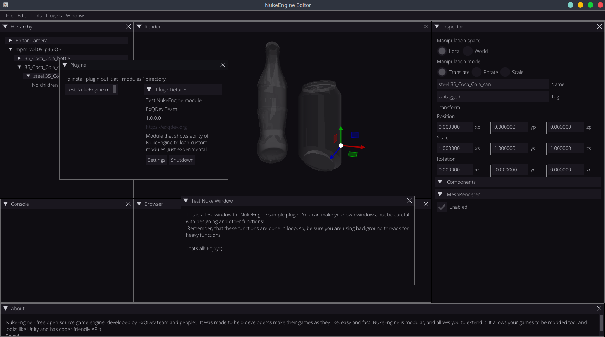

# NukeEngine - Editor

This is an editor for NukeEngine. We are using ImGui, opengl, boost and some other. Lua for lua integration and configs. Below you can see screeshot of it.

# Get it

Just clone this repo near the NukeEngine repo, and do instructions, provided in [this](https://github.com/ExQDev/TestNUKEModule/blob/master/README.md) file to set up dependencies.

# Building

Use Qt Creator to build it.

# Develop

You can expand it functionality, contributing it, or, by developing extentions. For more information about extentions, look [HERE](https://github.com/ExQDev/TestNUKEModule).